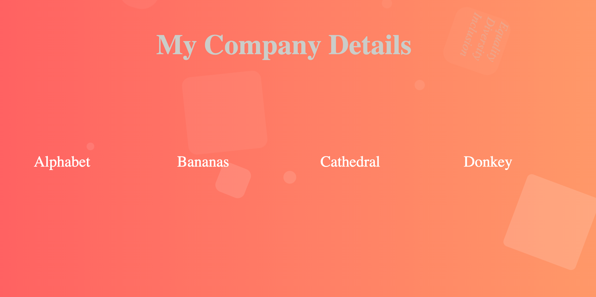
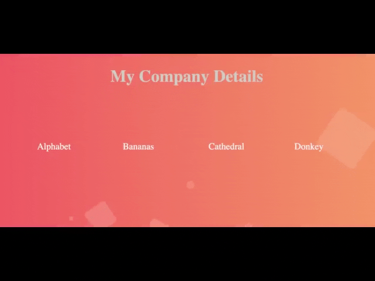

# 📝 Floating Boxes


### Table of Contents
* [Description](#description)<br>
* [How to use the App](#how-this-app-might-be-used)
            <br>1. [Features](#features)<br>2. [Why Use the app](#why-use-this-animation)<br>3. [Important Note](#important-note)<br>

* [Screenshot](#📷-screenshots)<br>
* [Short Film](#🎞️-short-film)<br>
* [My Portfolio](#🔗-links)<br>
* [Acknowledgements](#acknowledgements)<br>


## Description
 This is an application demonstrating CSS manipulation which allows boxes to float across the screen.

##  📖 How this app might be used.
#### Features

```
- The boxes can be resized.
- The background of each box can be a different colour.
- The background of each box can hold an image or text.
- The rotation of each box can be faster or slower.
- New shapes can be created.
```

#### Why use this animation.

```
- A floating box can add colour, texture and interest 
to an app.
- More interesting and engaging than a pop-up 
because they have to wait for it to go round again 
to catch any content they missed.
- Ideal for creating a relaxing meditative experience.
```

#### Important Note 
```
- If the application will be used on mobile devices, do not put too much text in each box.

```
## 📷 Screenshots

Here is a screenshot of a Homepage


                                                                                             

##  🎞️ Short film

This short film demonstrates the application in action.



### 🔗 Links
[](https://github.com/AbriCS)

### Author
- [@iteration50.io](https://www.iteration50.io/)

### Acknowledgements

 - [Awesome Readme Templates](https://awesomeopensource.com/project/elangosundar/awesome-README-templates)
 - [Webstyle Press](https://www.youtube.com/watch?v=89vz08bOT_M)  
 - [Emoji Icons](https://github.com/ikatyang/emoji-cheat-sheet/blob/master/README.md)

